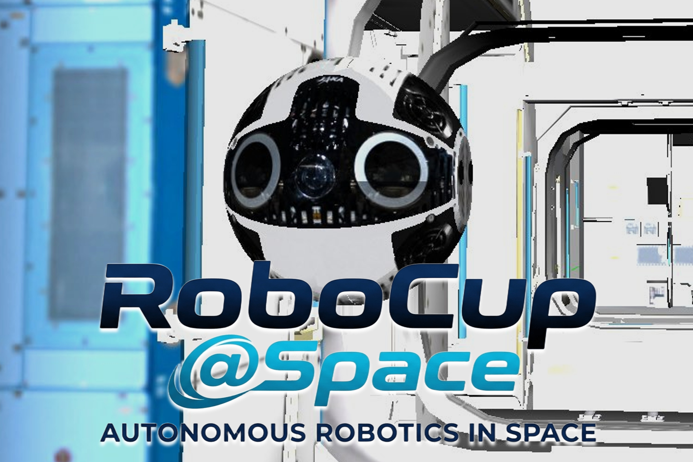

# RoboCup@Space

**RoboCup@Space**は、宇宙における自律型ロボットの発展や社会実装を目指したRoboCup Japan Openを対象とした競技会です。

## 目次
1. [**概要**](#概要)
2. [**競技内容**](#競技内容)
3. [**シミュレータ環境**](#シミュレータ環境)
4. [**採点項目**](#採点項目-仮)
5. [**スケジュール**](#スケジュール-仮)
6. [**学会発表情報**](#学会発表情報)
7. [**参考情報**](#参考情報)

 

## 概要
RoboCup@Spaceは、将来の月・惑星探査や軌道上サービスに不可欠な「AI × 宇宙ロボット」技術の発展を目的とした競技会です。自律型ロボットの競技会「RoboCup Japan Open」に新たなカテゴリとして新設しました。

コミュニティ：Discordサーバー  
・https://discord.gg/nCs4AzANwt

 

## 大会
- [2026年度](https://github.com/RoboCupAtSpaceJP/AtSpace2026/tree/main)

## 学会発表情報

### 第43回日本ロボット学会 学術講演会 (RSJ2025)

| 発表タイトル | 著者 | 要旨PDF |
|--------------|------|---------|
| RoboCup JapanOpen @Space Challenge の構想 | 萩原 良信 ほか | [📄 要旨PDFを開く](docs/1I1-03.pdf) |
| ISS船内ロボットInt-Ball2による技術実証とRoboCup@Spaceへの展開 | 池田 勇輝 ほか | [📄 要旨PDFを開く](docs/1I1-04.pdf) |

 

## 参考情報
- [RoboCup Japan Official Website](https://www.robocup.or.jp/)
- [無重力空間での自由飛行を進化させる！Int-Ball2が切り開く次世代ロボット技術](https://youtu.be/scgxLm3BY4k)
- [Int-Ball2が宇宙に旅立ちました！](https://humans-in-space.jaxa.jp/news/detail/003155.html)
- [Int-Ball2の初期チェックアウトを実施中！](https://humans-in-space.jaxa.jp/news/detail/003518.html)
- [Int-Ball2自律飛行と自動ドッキング実証実験に成功](https://www.kenkai.jaxa.jp/research/innovation/intball2.html)
- [宇宙で活躍する自律カメラロボット「Int-Ball2」、新たな機能拡張プラットフォームを軌道上で実証完了](https://humans-in-space.jaxa.jp/biz-lab/news/detail/004741.html)
- [「ICHIBAN」国際協力ミッション　国際宇宙ステーションで世界初独自開発したロボット同士の連携実証に成功](https://www.jaxa.jp/press/2025/07/20250731-1_j.html)

 

---

[トップに戻る](#robocupspace-2026-第1回)
